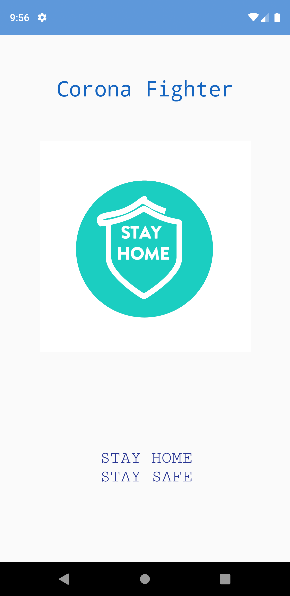
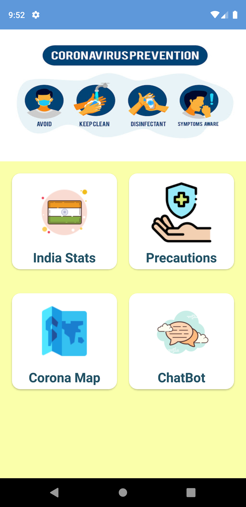
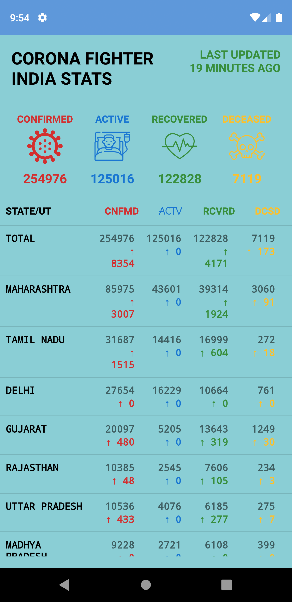
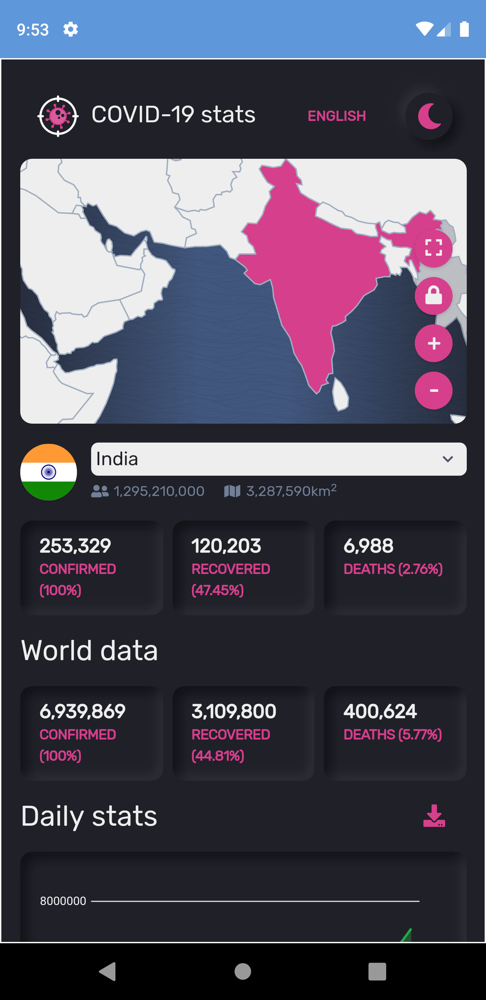
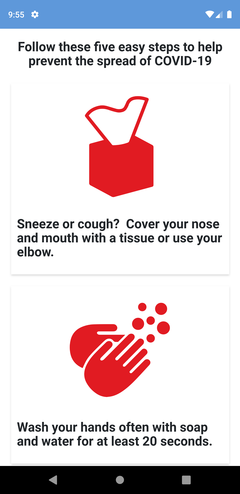

# CoronaFighter
Android App Built During #30_Days_of_Kotlin

## Tech used
- Android 
- Kotlin
- Corutines
- OkHttp
- GSON

## Requirements
* Android version 5.0 and above

## Screenshots
<table>
  <tr>
    <td></td>
    <td></td>
     <td></td>
 </tr>
 <table>
  <tr>
    <td></td>
    <td></td>
 </tr>

